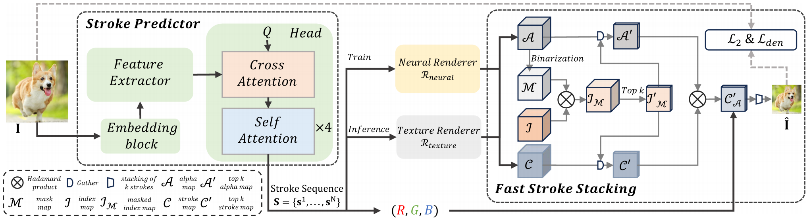

# [TVCG 2025] AttentionPainter: An Efficient and Adaptive Stroke Predictor for Scene Painting

### [Paper](https://ieeexplore.ieee.org/abstract/document/11193849) | [Suppl](https://ieeexplore.ieee.org/ielx8/2945/11231102/11193849/supp1-3618184.pdf?arnumber=11193849)

Official implementation of AttentionPainter, an efficient and adaptive stroke predictor for single-step neural painting.

[Yizhe Tang](https://scholar.google.com/citations?user=dp8qv-sAAAAJ&hl=zh-CN&oi=sra)<sup>1</sup>,
[Yue Wang](https://scholar.google.com/citations?user=kxpuv3YAAAAJ&hl=zh-CN&oi=sra)<sup>1</sup>,
[Teng Hu](https://scholar.google.com/citations?user=Jm5qsAYAAAAJ&hl=zh-CN)<sup>1</sup>,
[Ran Yi](https://scholar.google.com/citations?user=y68DLo4AAAAJ&hl=zh-CN)<sup>1</sup>,
[Xin Tan](https://scholar.google.com/citations?user=UY4NCdcAAAAJ&hl=zh-CN)<sup>2</sup>,
[Lizhuang Ma](https://scholar.google.com/citations?user=yd58y_0AAAAJ&hl=zh-CN)<sup>1</sup>,
[Yu-Kun Lai](https://scholar.google.com/citations?user=0i-Nzv0AAAAJ&hl=zh-CN)<sup>3</sup>,
[Paul L. Rosin](https://scholar.google.com/citations?user=V5E7JXsAAAAJ&hl=zh-CN)<sup>3</sup><br>
<sup>1</sup>Shanghai Jiao Tong University <sup>2</sup>East China Normal University <sup>3</sup>Cardiff University




## Prepare

System Requirements: The model was developed and trained on an NVIDIA RTX 4090 GPU (24GB VRAM).

1. Create a Virtual Environment (Conda recommended):

```bash
conda create -n attentionpainter python=3.8.5
conda activate attentionpainter
```

2. Install PyTorch:
We utilize the PyTorch LTS version for stability with CUDA 11.1 support:
```bash
pip3 install torch==1.8.2 torchvision==0.9.2 torchaudio==0.8.2 --extra-index-url https://download.pytorch.org/whl/lts/1.8/cu111
```

3. Install Dependencies:
```bash
pip3 install timm==0.6.12 \
opencv-python==4.1.2.30 \
numpy==1.20.3 \
pillow==9.5.0 \
tqdm==4.65.0 \
tensorboard==2.13.0 \
six==1.17.0
```

## Quick Start

### (0) Prepare
Checkpoints prepare: 

Download the [Neural Renderer](https://drive.google.com/file/d/1meZL9ayCKZGYYrFbisOI4wNonuYnTtEV/view) checkpoint and organize like:
```
- renderer-oil-FCN.pkl
```

Data prepare: Prepare the ImageNet Dataset. All the images can be saved and organized like:
```
- dataset
    - imagenet
        - train
            - ...
```

### (1) Train AttentionPainter

To train the AttentionPainter predictor with Fast Stroke Stacking (FSS) and Stroke-Density Loss, run:

```
python3 main_pretrain_oil_density_w_FSS.py \
--data_path=$PATH_TO_IMAGENET \
--nr_path=$PATH_TO_NEURAL_RENDERER
```

### (2) Test AttentionPainter

You can use your trained checkpoint or download the pretrained checkpoint from [this link](https://drive.google.com/file/d/1ChKUut9woFeVGzazoeIWNQp8724iT3jC/view?usp=drive_link), and generate paintings from a batch of test images:

```
python3 test_batch_oil_density_v2.py \
--img_dir=$PATH_TO_TEST_IMAGES \
--ckpt=$PATH_TO_TRAINED_CHECKPOINT \
--row_divide=$ROW_NUMBER \
--col_divide=$COLUMN_NUMBER \
--output_dir=$PATH_TO_OUTPUT
```

## Citation
If you find our work useful in your research, please cite:
```
@article{tang2025attentionpainter,
  title={AttentionPainter: an efficient and adaptive stroke predictor for scene painting},
  author={Tang, Yizhe and Wang, Yue and Hu, Teng and Yi, Ran and Tan, Xin and Ma, Lizhuang and Lai, Yu-Kun and Rosin, Paul L},
  journal={IEEE Transactions on Visualization and Computer Graphics},
  year={2025},
  volume={31},
  number={12},
  pages={10897-10911},
  publisher={IEEE}
}
```

## Acknowledgments

Our project benefits from the amazing open-source projects:

- [Compositional_Neural_Painter](https://github.com/sjtuplayer/Compositional_Neural_Painter)
- [Im2Oil](https://github.com/TZYSJTU/Im2Oil)
- [stylized-neural-painting](https://github.com/jiupinjia/stylized-neural-painting)
- [PaintTransformer](https://github.com/wzmsltw/PaintTransformer)
- [LearningToPaint](https://github.com/hzwer/ICCV2019-LearningToPaint)

We are grateful for their contribution.